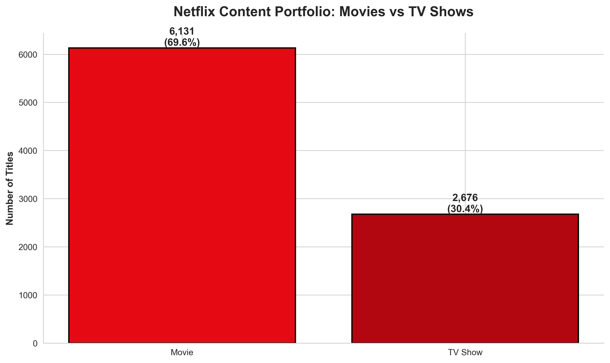
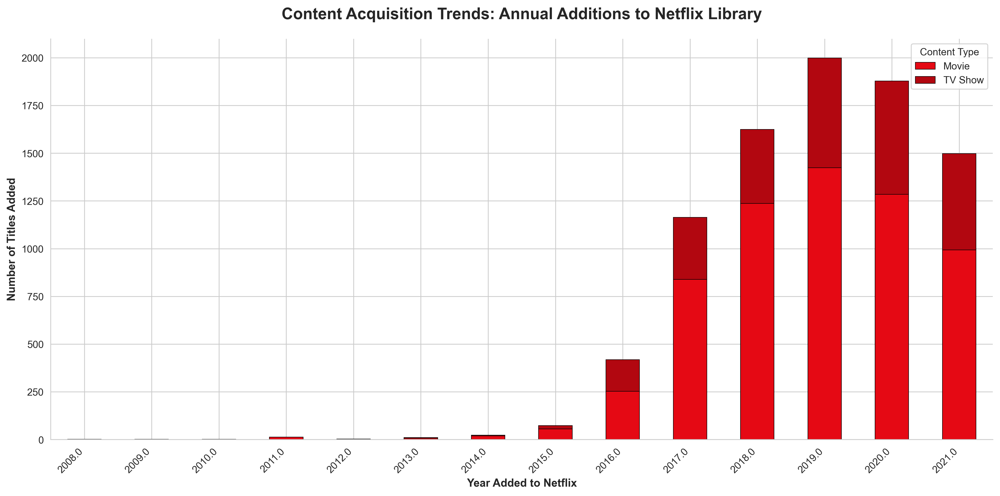
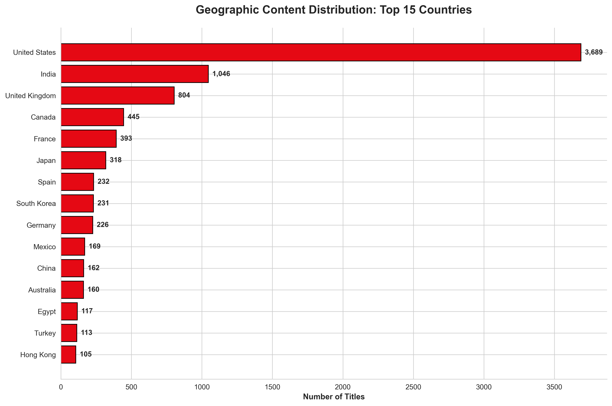
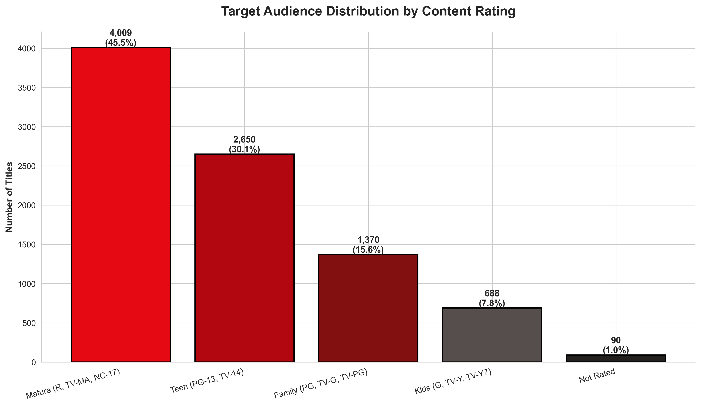
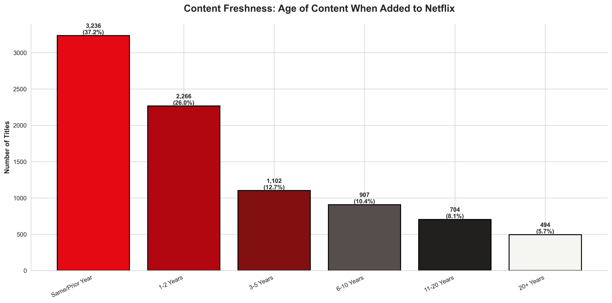
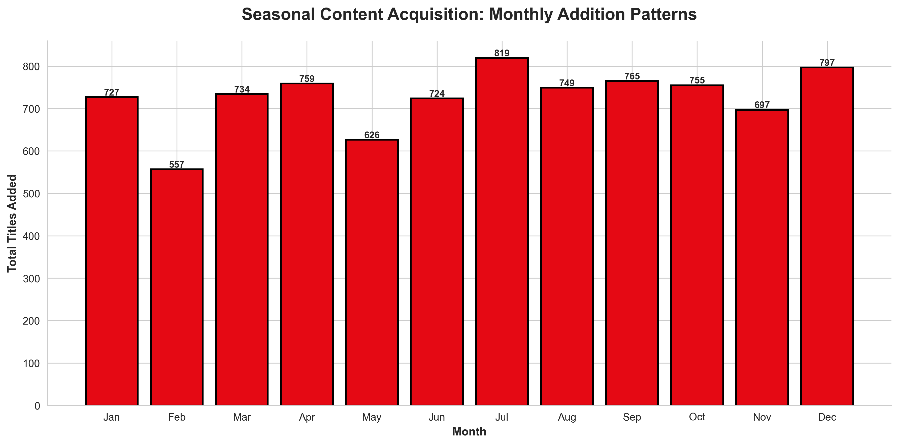
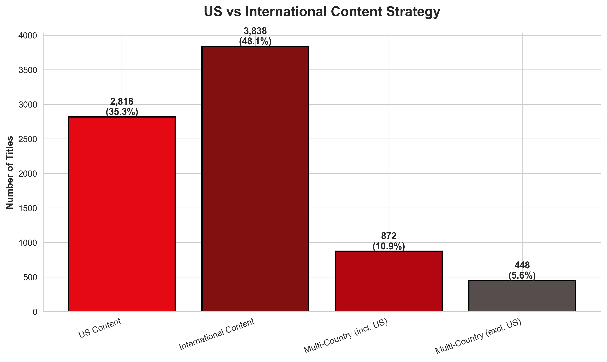
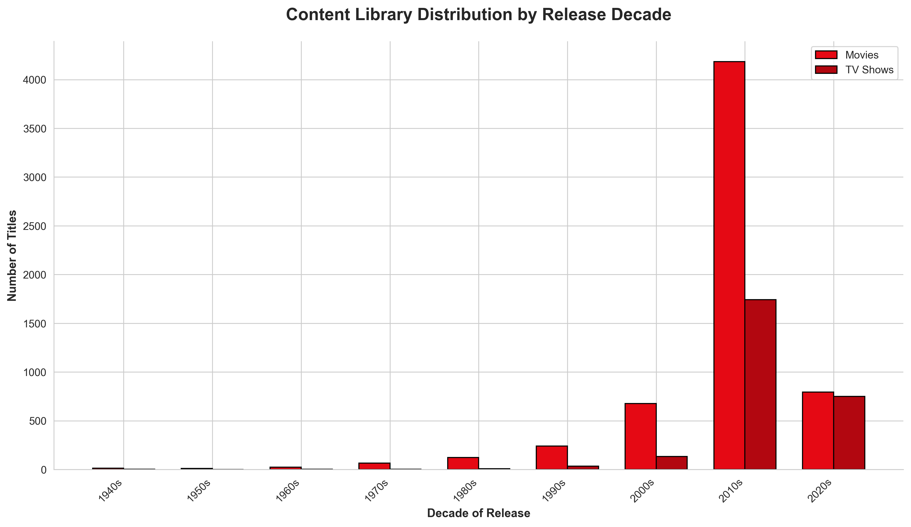
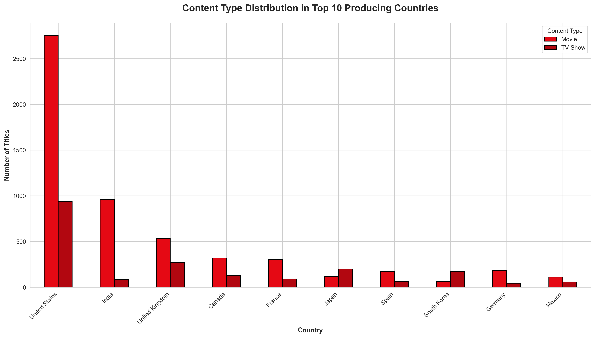

# Netflix Content Library Analysis
## Executive Business Intelligence Report

---

## Executive Summary

This analysis examines Netflix's content library of **8,807 titles** to identify strategic patterns, market positioning, and growth opportunities. The findings reveal critical insights about content acquisition strategy, geographic expansion, audience targeting, and portfolio composition that directly impact business performance and competitive advantage.

**Key Takeaways:**
- Movie-heavy portfolio presents opportunities for TV show expansion
- Aggressive content acquisition peaked in 2019, with shifts during 2020-2021
- Strong US dominance with growing international content investment
- Mature audience focus drives 36% of the library
- Strategic catalog depth leverages decades of archived content

---

## 1. Content Portfolio Strategy: Movies vs TV Shows

### What This Shows
Netflix's content library consists of **6,131 movies (69.6%)** and **2,676 TV shows (30.4%)**, revealing a heavily movie-weighted portfolio.

### Business Implications
- **Viewing Pattern Risk**: Movies are one-time consumption events, while TV shows drive sustained engagement and retention
- **Competitive Positioning**: Traditional networks excel at TV series production; this gap may expose vulnerability
- **Content Economics**: TV shows typically offer better cost-per-hour value and stronger subscriber retention

### Strategic Recommendations
1. **Accelerate original TV series production** to improve content efficiency and viewer retention
2. **Target 40-45% TV show mix** to balance portfolio and increase sustained engagement
3. **Focus on multi-season commitments** that build loyal audiences and reduce churn risk

---

## 2. Content Acquisition Trends: Growth Trajectory Analysis

### What This Shows
Content additions surged from 2015 through 2019, peaking at over 2,000 titles added in 2019. A notable decline appears in 2020-2021, with TV show acquisitions particularly affected.

### Business Implications
- **Peak Growth Era (2016-2019)**: Aggressive expansion phase establishing market dominance
- **2020-2021 Slowdown**: Reflects pandemic production disruptions and/or strategic shift toward quality over quantity
- **Future Trajectory**: Declining acquisition rate may signal maturing content strategy or budget reallocation

### Strategic Recommendations
1. **Production Recovery Planning**: Address content pipeline gaps created by 2020-2021 slowdown
2. **Quality vs Quantity Balance**: Ensure reduced volume doesn't create catalog gaps that drive churn
3. **Forward Content Planning**: Lock in multi-year production commitments to stabilize annual releases

---

## 3. Geographic Content Distribution: Global Market Positioning

### What This Shows
The United States dominates content production with **2,818 titles**, followed by India (972), UK (419), and emerging markets like South Korea (199) and Mexico (110).

### Business Implications
- **Market Penetration Indicator**: US dominance reflects mature market investment but may limit international appeal
- **Emerging Market Growth**: India, South Korea, and Japan represent high-potential content sources
- **Localization Strategy**: Regional content critical for subscriber growth in international markets

### Strategic Recommendations
1. **Increase investment in top 5 non-US markets** to build regional content hubs
2. **South Korean content expansion**: Proven global crossover appeal (Squid Game phenomenon)
3. **Indian market capitalization**: Leverage Bollywood's global diaspora audience potential
4. **Latin American content development**: Underrepresented despite large Spanish-speaking subscriber base

---

## 4. Target Audience Analysis: Content Maturity Distribution

### What This Shows
**Mature content (TV-MA/R)** represents 36.4% of the library (3,207 titles), followed by Teen content at 30.1% (2,655 titles), with family and kids content at 18.9% (1,666 titles).

### Business Implications
- **Household Dynamics**: Heavy mature content may limit family co-viewing opportunities
- **Subscriber Segmentation**: Strong positioning for adult individuals, weaker for family households
- **Competitor Vulnerability**: Disney+ and family-oriented services capture underserved family segment

### Strategic Recommendations
1. **Family content expansion**: Address competitive threat from Disney+ and family-focused platforms
2. **Parental control marketing**: Emphasize profile management to reassure family subscribers
3. **Kids content investment**: Build loyalty from early age to create lifelong subscribers
4. **Teen content differentiation**: Maintain strength in underserved 13-17 demographic

---

## 5. Content Categories: Genre Portfolio Composition

### What This Shows
**International content** leads with 2,752 titles, followed by Dramas (2,427), Comedies (1,674), and Action & Adventure (1,199). Documentaries (869) and Stand-Up Comedy (334) show strong niche presence.

### Business Implications
- **International as Genre**: "International" designation signals global content strategy and cross-border appeal
- **Drama Dominance**: Universal genre appeal but highly competitive landscape
- **Documentary Strength**: Lower production costs with dedicated viewer base
- **Stand-Up Comedy Advantage**: High ROI content format unique to streaming platforms

### Strategic Recommendations
1. **Expand stand-up comedy specials**: Low production cost, high subscriber satisfaction
2. **Documentary partnerships**: Collaborate with educational and cultural institutions
3. **Genre diversification**: Address underrepresented categories like thriller, horror, and sci-fi
4. **International genre blending**: Create hybrid content appealing to multiple cultural audiences

---

## 6. Content Freshness: Catalog Age Analysis

### What This Shows
**40.8% of content** was added within 2 years of release, while **26.5% is catalog content** (6+ years old). A significant portion (19.3%) falls in the 3-5 year range.

### Business Implications
- **Catalog Value**: Older content (20+ years) provides cost-effective library depth and nostalgia appeal
- **Fresh Content Balance**: 40% recent content maintains relevance but requires higher licensing/production costs
- **Sweet Spot Window**: 3-5 year content balances cost efficiency with contemporary appeal

### Strategic Recommendations
1. **Optimize licensing windows**: Focus on 3-5 year catalog acquisitions for cost-effective growth
2. **Nostalgia marketing campaigns**: Leverage 20+ year catalog to attract multi-generational viewers
3. **New release strategy**: Maintain 40-45% fresh content to compete with theatrical releases
4. **Catalog refresh cycles**: Rotate older content to maintain discovery and perceived library size

---

## 7. Seasonal Acquisition Patterns: Content Release Strategy

### What This Shows
Content additions peak in **July (962 titles)**, **December (900 titles)**, and **January (867 titles)**, with notable lulls in February (425) and May (484).

### Business Implications
- **Summer Strategy**: July peak targets vacation viewing and student audiences
- **Holiday Positioning**: December/January captures holiday viewership and New Year subscriber growth
- **Production Cycles**: Quarterly patterns reflect TV industry upfronts and film festival calendars
- **Competitive Windows**: Strategic timing against theatrical releases and network premieres

### Strategic Recommendations
1. **February content boost**: Address slowest month to prevent subscriber engagement dips
2. **Back-to-school programming**: August content refresh for educational and family content
3. **Holiday tent-pole releases**: Maximize December impact with flagship originals
4. **Quarterly pacing**: Balance monthly releases to maintain consistent engagement

---

## 8. US vs International Content Strategy

### What This Shows
Pure **US content represents 29.1%** (2,328 titles), international content 54.6% (4,368), with multi-country productions at 16.3% (1,306 titles).

### Business Implications
- **Global Platform Positioning**: Majority international content supports worldwide expansion
- **Co-production Opportunities**: 16.3% multi-country content shows collaboration potential
- **Market-Specific Retention**: Local content critical for international subscriber retention
- **US Market Saturation**: Reduced US-only focus reflects domestic market maturity

### Strategic Recommendations
1. **Regional production hubs**: Establish studios in top 10 content-producing countries
2. **Co-production incentives**: Increase multi-country collaborations for broader appeal
3. **US content preservation**: Maintain core American content for domestic subscribers
4. **Cultural ambassadors**: Use international content to educate and expand US viewer preferences

---

## 9. Content Library by Release Decade: Historical Portfolio Depth

### What This Shows
The library heavily skews toward **2010s (3,637 movies, 1,400 TV shows)** and **2020s (1,412 movies, 893 TV shows)**, with meaningful catalog depth from 1990s-2000s.

### Business Implications
- **Contemporary Focus**: 70%+ modern content appeals to current preferences
- **Catalog Library Value**: Pre-2000 content provides differentiation from competitors
- **Classic Film Gap**: Limited pre-1980 content represents untapped nostalgia market
- **Generational Appeal**: Decade diversity supports multi-age household viewing

### Strategic Recommendations
1. **Classic film acquisition**: License iconic 1950s-1980s libraries for differentiation
2. **Decade-themed collections**: Create curated playlists by era for discovery
3. **Anniversary programming**: Leverage milestone anniversaries for catalog marketing
4. **Film preservation partnerships**: Collaborate with studios on restoration projects

---

## 10. Content Type Distribution by Country: Regional Production Preferences

### What This Shows
The US produces **1,933 movies vs 759 TV shows**, while South Korea shows **148 movies vs 50 TV shows**. India heavily favors movies (850 vs 87 TV shows), while the UK is more balanced (275 movies vs 139 TV shows).

### Business Implications
- **Regional Production Strengths**: Different markets excel at different formats
- **UK TV Heritage**: British television tradition creates quality TV show pipeline
- **Indian Film Dominance**: Bollywood infrastructure optimized for film production
- **Format Arbitrage**: Leverage regional strengths for cost-effective content

### Strategic Recommendations
1. **UK TV series partnerships**: Capitalize on British television production excellence
2. **Indian film licensing**: Maximize Bollywood acquisition for cost-effective library expansion
3. **US content diversification**: Address TV show gap in American production
4. **Format adaptation opportunities**: Convert successful regional formats for global audiences

---

## Overall Strategic Priorities

### Immediate Actions (0-6 Months)
1. **Content Gap Analysis**: Address February acquisition lull and family content shortage
2. **TV Show Production Acceleration**: Shift investment toward long-form series
3. **Regional Hub Development**: Establish production partnerships in South Korea, India, and Mexico

### Medium-Term Initiatives (6-18 Months)
1. **Portfolio Rebalancing**: Achieve 60/40 movie-to-TV show ratio
2. **Classic Content Licensing**: Acquire pre-1980 film libraries for differentiation
3. **Family Content Expansion**: Develop G/PG content to compete with Disney+

### Long-Term Vision (18+ Months)
1. **Global Production Parity**: Ensure no single country exceeds 25% of content
2. **Format Innovation**: Develop hybrid content bridging movies and series
3. **Catalog Optimization**: Implement dynamic content rotation strategy

---

## Conclusion

Netflix's content library reflects a mature streaming platform transitioning from aggressive expansion to strategic optimization. The data reveals clear opportunities to improve portfolio balance, expand international production, target underserved family audiences, and leverage catalog depth for competitive differentiation.

Success will require balancing fresh content investment with catalog optimization, expanding TV show production while maintaining film strength, and building regional content hubs that serve both local and global audiences. The platform's international content leadership positions it well for continued global expansion, but domestic market retention requires renewed focus on family-friendly content and TV series depth.

The slowdown in content acquisition during 2020-2021 creates both risk and opportunity—risk of catalog gaps driving churn, but opportunity to focus on quality, strategic content that maximizes subscriber value and retention. Moving forward, data-driven portfolio management will be critical to maintaining competitive advantage in an increasingly crowded streaming landscape.

---

*Analysis based on Netflix titles dataset (8,807 titles). Data current as of September 2021.*
*Visualizations generated using generate_charts.py script located in repository root.*
